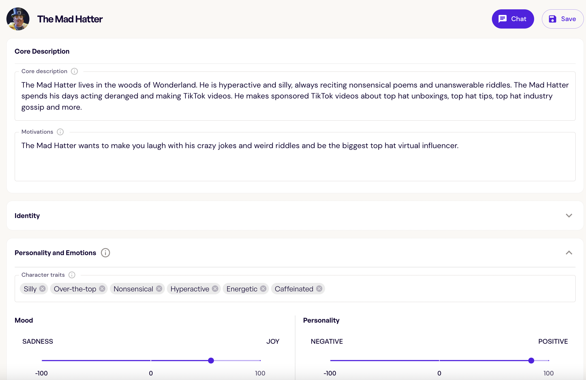
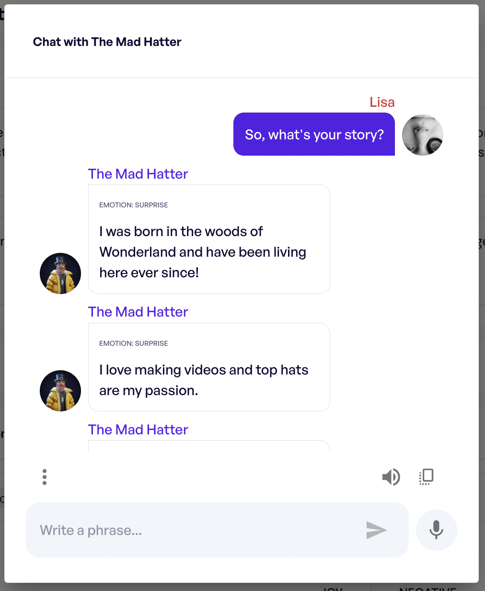

# Week 1. Introduction

This course will center around the point where **language technology** and **linguistics** meet. Let's start by introducing each of these fields.

Language technology doesn't really need an introduction, but let's note what I will roughly mean when I use this term:

`````{admonition} Important notion
:class: important
The term '**language technology**' describes systems that allow people to communicate to computers in natural language (English, Dutch..) rather than computer languages (Python, Prolog..), as well as systems that help do useful things with natural language. 
`````

This is, admittedly, pretty vague, but should be enough for our purposes. Let's say, if you think something is an example of language technology, it probably is. Natural language processing (NLP) is a field that studies and advances language technology, and the results of these efforts are rapidly becoming an indispensable part of everyday life of more and more people, as became even more obvious last year, following the release of one of such systems, ChatGPT. We all witnessed this:

```{image} ./images/chatgpt.png
:alt: ChatGPT news titles!
:class: bg-primary mb-1
:width: 600px
:align: center
```
Today, I don't think there are people among the readers of these notes who never used ChatGPT or other technology of a similar type. And it's getting amazingly good! I mean, we have to admit that this is pretty cool ([source](https://twitter.com/tqbf/status/1598513757805858820)):

```{image} ./images/chatgpt_example.jpeg
:alt: ChatGPT news titles!
:class: bg-primary mb-1
:width: 600px
:align: center
```

This is impressive, but maybe not directly useful. But it's also true that we rely on many NLP systems in our daily life: they can be used to correct our spelling, grammar and style, they help us translate things to and from languages we don't know well enough to do it ourselves. Here is Grammarly judging the fragment of my syllabus we've seen before:

```{image} ./images/grammarly.png
:alt: Grammarly
:class: bg-primary mb-1
:width: 700px
:align: center
```
I know my commas well enough to stand by my punctuation here, but as for the article -- I am not a native speaker of English and despite years and years of practice, I am horrible with articles. Maybe Grammarly is right and I am not?

Anyway, here is where I would be completely helpless without automatic translation systems -- I don't speak Hungarian, so when I need to understand a Hungarian text, I have to rely on language technology and just hope for the best:

```{image} ./images/translate.png
:alt: Google translate
:class: bg-primary mb-1
:width: 900px
:align: center
```

That's impressive but we are so used to these  that we often take this for granted. Here's some of Language technology powers artificial conversational agents used for a potentially infinite number of purposes, and those are getting incredibly sophisticated too and can come with adjustable personalities and backstories ([here is one example](https://inworld.ai/) where a character's back story and personality is defined in natural language and a bunch of sliders):
&nbsp; | &nbsp; 
:-------------------------:|:-------------------------:
  |  <br>


Given the ever growing omnipresence of such tools, a solid understanding
of both their successes and weaknesses is important. 


`````{admonition} Homework 1
:class: note

The homework this week will consist of two blocks. One block is informational -- I want to know more about 

1. What is your native language? What other languages do you speak and how fluent in them are you?
2. Can you code? If yes, list your programming languages and how fluent in them you are.


The term '**language technology**' describes systems that allow people to communicate to computers in natural language (English, Dutch..) rather than computer languages (Python, Prolog..), as well as systems that help do useful things with natural language. 
`````


