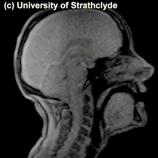

# Week 2. Transmitting and Capturing Language

`````{admonition} TL;DR
:class: note
- Phonetics is a field studying speech sounds. Speech sounds can be classified via the way they are pronounced (articulatory phonetics) or via the resulting acoustic signal (acoustic phonetics). 
    - Some corner cases: whistle languages, drum languages
    - Not all languages use sounds! Sign languages
- Language in various modalities: speech vs. sign
- Secondary languages: overview
`````

Languages comes in many forms and modalities: it can be spoken, it can be signed, it can be written, even whistled and played on drums. We will go over some ways language is transmitted and captured, just to give you an idea of the landscape of language modalities, and then we will see some ways this knowledge is relevant for language technology.

## Sound

Let's start with speech sounds and take a peek into the areas of linguistics that deal with them. First things first, some important notions:

`````{admonition} Important notions
:class: warning

- **Phonetics** studies speech sounds.
    - **Articulatory phonetics** studies how these sounds are produced in human body.
    - **Acoustic phonetics** studies the acoustic signal produced as a result of pronunciation. 
- **Phonology** studies the system and patterns of how speech sounds are used in a language.
`````

There is a huge variety of sounds each of us can produce -- clearing out throat, saying _aaa_, clapping our hands, and so on. Among these sounds, a relatively small subset can be called 'speech sounds'. Those are the sounds produced by the speakers of a language when they speak that language. There is 


There is quite a lot of variation between languages in that respect -- some sounds that are not speech sounds in one language, can be used in another language. 


```{margin} 
[Source](https://web.stanford.edu/~jurafsky/slp3/28.pdf), originally from OpenStax University
Physics, CC BY 4.0
```


```{image} ./images/vocal_tract.png
:alt: ChatGPT news titles!
:class: bg-primary mb-1
:width: 500px
:align: center
```


|              |              |               |               |               | 
|   :----:    |    :----:    |    :----:    |     :----:   |     :----:   |
|   |    |     |   |    |


- Whistled speech
- Holy languages
- Secret languages
- Male/female languages
- Morse code
- Smoke signals

- Case studies: Lokele (Congo), Yoruba (Nigeria), Akan (Ghana), Banda-Linda (Central
       African Republic)
       


When you speak -- as opposed to sign (if you are using signed languages) or write, you make sounds by producing an airflow, typically from the lungs, which gets obstructed in various ways in the vocal tract. 

One way of talking about speech sounds is through where in the vocal tract the airflow gets obstructed and how. So we can classify speech sounds by **place of articulation**. 


place of articulation
voice
manner of articulation -- stops and fricatives
... and nasals (nasal stops)!

alveolar nasal?


Vowel harmony
Stress


Whistled languages are found in many parts of the world, usually within communities living in mountainous or densely vegetated landscapes, where humans often find themselves scattered in long distances from one another, being unable to hear each other when speaking or shouting. Whistling is then employed as it can travel much longer than speech and it can overcome ambient noise much more effectively.

Whistled languages are not distinct from spoken languages and there is no case of a whistled language which is not based on some spoken language. Whistled speech always relies on a spoken language. It does not replace but rather accompanies spoken language and the two are used in different occasions.

Whistled languages hold poorer means to convey meaning than spoken languages. The numerous acoustic formants of spoken sounds have to be mapped on the one and only formant of whistled speech. The current UCL project focuses on the whistled speech of the village of Antia, on the Greek island of Euboea. It is based on Greek, a non-tonal language. 


## Gesture

## Writing