# Weeks 2-3. Transmitting and Capturing Language


The topic of how language is captured and transmitted is a big one -- it will take us two lectures to cover it. Usually, in introductions to linguistics speech sounds (in spoken languages) and the phonology of signed languages are covered in one lecture (if the latter is covered at all) and writing systems are more often than not left out altogether. For a course like this -- aspects of linguistics tailored for Information Science students -- it's important to spend some time on these topics, as these different forms of language transmission are inputs to language technology systems, and being aware of different properties of these linguistic modalities is important in order to understand potential strengths and weaknesses of different types of systems, as well as what kinds of challenges these different systems face depending on the modality they work with. 


`````{admonition} PARTS
:class: note
- PART I: Sounds and signs
- PART II: Writing
- PART III: Language modalities and language technology
`````


## PART I. Sounds and signs

`````{admonition} TL;DR [[slides](https://docs.google.com/presentation/d/1CHYX2jWhGrkimSzslvOOdrveLX4n8i6Qy7wi7JYyd7M/edit?usp=sharing)]
:class: note
- **Phonetics** as a study of speech sounds. Articulotary and acoustic phonetics. 
    - Some corner cases: whistle languages, drum languages
    - Not all languages use sounds! Sign languages
- **Phonology**: speech sounds on a more abstract level; constraints on their possible combinations into sequences etc etc.
- Speech sounds organized in bigger units: **syllables** and **words**; variation in available structures for these units and rules governing this organization (syllable types, stress patterns).
`````

Languages comes in many forms and modalities: it can be spoken, it can be signed, it can be written, even whistled and played on drums. We will go over some ways language is transmitted and captured, just to give you an idea of the landscape of language modalities, and then we will see some ways this knowledge is relevant for language technology.

### Sound

Let's start with speech sounds and take a peek into the areas of linguistics that deal with them. First things first, some important notions:

`````{admonition} Important notions
:class: warning

- **Phonetics** studies speech sounds.
    - **Articulatory phonetics** studies how these sounds are produced in human body.
    - **Acoustic phonetics** studies the acoustic signal produced as a result of pronunciation. 
    - **Auditory phonetics** studies what happens when a person hears speech. We won't have much to say about the latter two in this course, unfortunately!
- **Phonology** studies the system and patterns of how speech sounds are used in a language.
`````

There is a huge variety of sounds each of us can produce -- sneezing, saying _aaa_, clapping our hands, and so on. Among these sounds, a relatively small subset can be called 'speech sounds'. Those are the sounds produced by the speakers of a language when they speak that language. There is quite a lot of variation between languages in that respect -- some sounds that are not speech sounds in one language, are used in another language. For instance, a sound of disapproval, often represented as _tsk_ in writing, is not part of English as a speech sound (for instance, there are no words in English using this sound -- apart from the actual _tsk_, which is not your typical word; it also doesn't really combine with other English sounds), but is used a lot in languages in the south of Africa, along with other so-called clicks. English sounds written as _th_ in _thrive_ is not a speech sound in French, and so on. The study of speech sounds is called **phonetics**.

`````{admonition} A tiny question along the way
:class: attention 
Do you know a sound that the Dutch language has that English doesn't?
`````

One thing these various sets of speech sounds used in different languages have in common is that they are produced by roughly the same set of organs in the human body. Here is a schematic depiction of human vocal organs:

```{margin} 
[Source](https://web.stanford.edu/~jurafsky/slp3/28.pdf), originally from OpenStax University
Physics, CC BY 4.0
```

```{image} ./images/vocal_tract.png
:alt: Speech organs
:class: bg-primary mb-1
:width: 500px
:align: center
```

In the schematic dissection of the head in this diagram (which is for some reason saying _aaa_), you will see some parts and organs marked. Those are the parts typically responsible for producing speech sounds. The sounds can be looked at through the lens of where and how they are produced, which is the area of study called **articulatory phonetics**.

Speech sounds are produced by movement of air -- typically, from the lungs, but we will see some exceptions to that -- through the vocal tract with whatever it meets on its way, coming out of the mouth or nose.  Sounds differ in the position of the organs when making the sound and how the air flows through the speech organs.

Before we move on to how different sounds relate to the place and manner of articulation, a side-note is due on how we represent sounds in writing. This is not going to be a note about writing systems! We will talk about them later. This is just to draw your attention to the fact **orthography** -- or **spelling** -- does not always represent the sounds of language consistently.  You might have heard of the **ghoti** example showing this for English -- a creative misspelling of a word that you might not be able to decipher from this spelling at all, and yet it follows spelling practices actually attested in English orthography.

`````{admonition} A tiny question along the way
:class: attention 
Can you guess what word this is?
`````

```{margin} 
The **/ /** signs surrounding _f_, _i_ and &#643; here mark the fact that we are talking about symbols for sounds, not the English (or any other, for that matter) orthography. You will sometimes see different brackets used for this purpose: **[ ]** or **< >**. Sometimes, two of these are used to distinguished between writing down specific sounds vs. more abstract sounds, without details of pronunciation that don't matter for contrasts in the language discussed. We will not make this distinction.
```

The word is _fish_. This word has three sounds, let's write them down as /f/, /i/ and /&#643;/ (together -- /fi&#643;/). How come it can be written down as _ghoti_? Here is how:

|              |              |              | 
|   :----:    |    :----:    |   :----:    |
**gh** | /f/ | pronounced as /f/ in _enou**gh**_ or _tou**gh**_ |
**o** | /i/ | pronounced as /i/ as in _w**o**m**e**n_ |
**ti** | /&#643;/ | pronounced /&#643;/ as in _na**ti**on_ or _mo**ti**on_

Of course, nobody would actually write the word _fish_ like this, and these correspondences between writing and sound are not **actually** supported by English orthography, but what this creative misspelling highlights is the very fact that there we cannot rely on correspondences between writing and sound. Besides the fact that not every writing system is based on such correspondence to begin with, orthography is influenced by a bunch of historic factors and things can get pretty complicated there. 

The standard way of transcribing language (= writing down speech sounds) is the **International Phonetic Alphabet** (IPA) developed by the [International Phonetic Association](https://www.internationalphoneticassociation.org/) (There are other systems as well, see this week's reading). I will introduce you to some symbols of IPA along the way.

Let's get back to the sounds! The two main groups linguistic sounds fall into are **vowels** and **consonants**. Consonants are produced with restriction or closure in the vocal tract that obstructs the flow of air. Vowels are produced with little to no restriction of the airflow, are (almost!) always voiced, and are generally louder and longer-lasting than consonants.

#### Vowels

The quality of the vowel depends on the shape of the vocal tract as the air passes through. Different parts of the tongue can be high or low in the mouth;  the mouth can be open to a different degree; the lips can be rounded or not rounded. The space of possible vowels is usually organized mostly along two parameters -- the low-high scale and the front-back scale. Both of these parameters refer not to the quality of the resulting sound (high pitch, for instance), but on the position of the articulatory organs. High vowels are those for which the tongue is positioned high and the mouth is not very open. When pronouncing front vowels, the high point of the tongue is towards the front. The four-angled shape corresponding to different values of these two parameters fits the whole space of possible vowels and has direct anatomic correspondence, as in this diagram:

```{margin} 
[Source](https://www.cambridge.org/elt/blog/fig-2-the-vowel-trapezium-a-schematic-representation-of-the-production-of-vowels/ )
```

```{image} ./images/vowels.png
:alt: Vowels
:class: bg-primary mb-1
:width: 350px
:align: center
```

On top of front-back vs. high-low (sometimes also known as closed-open) distinctions, vowels can also be rounded or not rounded (the latter require lips to be rounded during pronunciation -- roughly the same lip shape that's used for  whistling). Look at the MRI scan of a person pronouncing three very contrasting vowels from the peripheries of the quadrilateral: /i/ is front and high, /a/ is open and somewhere in the middle in terms of front-back, /u/ is back and high. /u/ is also rounded, unlike the other two:

```{margin} 
This set of MRI images and the ones I'll be using later on this week are taken from the fantastic resource '[Seeing speech](https://www.seeingspeech.ac.uk/ipa-charts)'. Check it out!
```

|      |       |       |
| :-: | :-: | :-: |
| 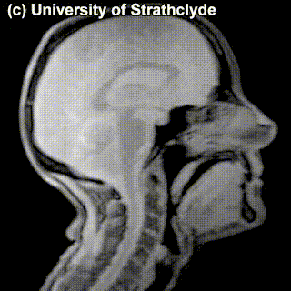  | 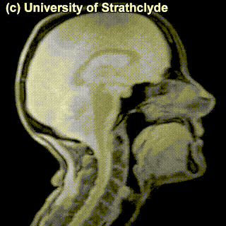  | 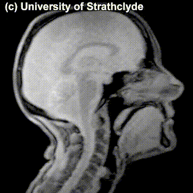   |
| **/i/**    |  **/a/**   |  **/u/**  |

`````{admonition} A tiny question along the way
:class: attention 
What if /u/ were not rounded? Can you produce a sound that would correspond to the non-rounded /u/? What about rounded /i/?
`````

```{margin} 
Generalizations about sound systems that I discuss here and below mostly come from _[Hyman, L. M. 2008. Universals in phonology. The Linguistic Review, 25, 81-135](https://doi.org/10.1515/TLIR.2008.003)._
```

The repertoire of vowels in different languages varies a lot. In general, the number of vowels in a language is smaller than the number of consonants that the language has, but not universally so -- [Iau](https://en.wikipedia.org/wiki/Iau_language) has six consonants and eight vowels, while [Puinave](https://en.wikipedia.org/wiki/Puinave_language) has eight consonants and eleven vowels. 

The set of vowels a language has can be as small as three (the existence of even smaller vowel systems is disputed, see below). The actual vowels that make up these small systems are not random. The IPA set contains 22 vowel symbols, but if we look at the 23 attested 3-vowel languages, only a subset of 10 vowels are found in such systems. Moreover, there are only 8 types of 3-vowel systems found in languages of the world, which is a very very small subset of the set of all possible 3-vowel combinations taken out of the set of 22 vowels (_C<sub>3</sub>(22) = 1540_). Among those 3-vowel systems, only two are comparatively frequent, with 11 and 4 languages that have these systems, respectively:

```{image} ./images/iua.png
:alt: Vowels
:class: bg-primary mb-1
:width: 350px
:align: center
```

The rest have been found only once (which equals to 4.8\% in the 23-language sample):

```{image} ./images/vowel_typology.png
:alt: Vowels
:class: bg-primary mb-1
:width: 420px
:align: center
```

Here is one of the many examples of **unattested** vowel systems in languages of the world: 

```{image} ./images/iyu.png
:alt: Vowels
:class: bg-primary mb-1
:width: 180px
:align: center
```

 `````{admonition} Discussion point
:class: tip
Why do you think a vowel system like that is not found in languages of the world?
`````

There are additional contrasts between vowels that we haven't mentioned yet:

- **Length**: vowels can be long or short;
- **Nasality**: nasal counterparts of oral vowels are produced with air flow escaping through the nose and the mouth simultaneously;
- **Tone**: the pitch level or pitch level change during pronunciation (more accurately, tone characterizes syllables, but it manifests itself mostly on vowels, so I list it here).

This is a good moment to take a step back and ask ourselves: What exactly does it mean for a language to have or not to have a particular vowel (or a particular sound, in general)? When we say that a language doesn't have nasal vowels, does it mean that its speakers **can't** pronounce a vowel with air flowing through the nasal cavity in addition to the mouth? Not really. Does it mean that speakers just **don't** produce nasal vowels at all while speaking? Or, returning to our case of 3-vowel systems, does it mean that the speakers never produce any vowels that don't strictly coincide with one of the three vowels that their systems consist of? Also, not really. The speakers of 3-vowel languages definitely end up producing sounds that, if we describe the pronunciation carefully enough, would end up at some other point in the vowel quadrilateral. 

So, what **does** it mean then? It's not so clear, actually. As a first approximation, it means that even though in actual speech sounds can differ in a number of ways, a language is blind to some of these distinctions -- it doesn't use them as an architectural device in building its bigger units (roots, suffixes, words) from sounds. Most prominently, this means that the language does not have **minimal pairs** built on the distinction in question: two words that mean different things and only differ in the feature. French -- one of the languages with nasal vowels -- uses the nasal vs. oral contrast in building its lexicon, as evidenced by minimal pairs like /p&#603;&#771;/ _pain_ 'bread' vs. /p&#603;/ _paix_ 'peace'.

Identifying and explaining generalizations about how speech sounds are organized into systems that languages employ to build words is studied by the field of **phonology**. 

```{margin} 
<br>
<br>
<br>
<br>

Notice that this 3-vowel analysis of Kabardian does not appear in the list of 3-vowel systems above! This is because in the database the above data come from an even different analysis of Kabardian is adopted! Things are tough.
``` 
A lot of questions in phonology require very nuanced theoretical discussion on how to identify which aspects of speech sounds matter linguistically in which language, how different these abstract systems of sounds can be from the space of sounds that speakers of these languages actually produce, and so on. Analysis of vowels in the [Kabardian language](https://en.wikipedia.org/wiki/Kabardian_language) is a good example of this. Here are different analyses of the system of Kabardian vowels that actually have been argued for in the literature:

1. / &#616;, &#601;, a /
2. / &#601;, a /
3. / a /
4. No vowels

`````{admonition} A note
:class: attention, dropdown
BTW, remember how last week we asked -- what can the result of linguistic analysis look like? Is it a formula? A statistical model? Well, here we have results of linguistic analysis: it can take form of a list of vowels (sometimes, empty).
`````


That's quite a range! Unfortunately, we will not talk much about these kinds of phonological discussions, but feel free to explore phonology further on your own. 

`````{admonition} A tiny question along the way
:class: attention 
Can you read this phrase transcribed in IPA? 

> /k&#601;n 'ju 'spik 'm&#596;r 'slo&#650;l&#618;/ 

You can check [the IPA charts](https://www.seeingspeech.ac.uk/ipa-charts/) for the sounds you are not sure about.
`````

#### Consonants

Unlike vowels, consonants are made by blocking or restricting of the airflow -- in pronunciation of vowels, the speech organs don't restrict the airflow as much. Like vowels, consonants can be organized according to positions of articulation organs responsible for the sound. Here's another schematic half-face for you, this time with a more detailed annotation of organs that are relevant for consonants:

```{margin} 
Places of articulation: 1. bilabial; 2. labiodental; 3. interdental; 4. alveolar; 5. (alveo)palatal; 6. velar; 7. uvular; 8. glottal.
_The Vocal Tract scheme from Fromkin, Rodman \& Hyams. An Introduction to Language. 2018, 11th ed._
```

```{image} ./images/consonants_face.png
:alt: Half-face again
:class: bg-primary mb-1
:width: 400px
:align: center
```

If we group some common vowels according to the place of articulation, we would get something like this;


|   bilabial   |  labiodental     |   (inter)dental    |   alveolar    |   palatal    |   velar / uvular   |   glottal    |
| :-: | :-: | :-: | :-: | :-: | :-: | :-: |
| m, p, b | v, f |     | n, t, d, s, z, l | t&#643;, d&#658;, &#643;, &#658;, j | &#331;, k, (g), x, &#611; | &#660; |

`````{admonition} A tiny question along the way
:class: attention 
There's nothing in the **(inter)dental** cell. 'Interdental' means that the sound is produced by air flow through a narrow opening between the teeth, with the tip of the tongue between the upper and lower front teeth. Which sounds would go there? Does Dutch have these sounds?
`````

Check out the MRIs of /m/ and /g/ and how physically different the pronunciation of these sounds is:

|      |       | 
| :-: | :-: | 
| 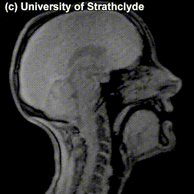  | 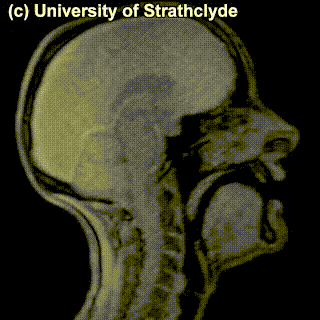  |
| **/m/**    |  **/g/**   |

`````{admonition} A tiny question along the way
:class: attention 
You might have noticed the absence of /r/ in the table above. How do you pronounce /r/? Where would you place it in the table?
`````

The **place of articulation** is not the only thing that characterizes a consonant. It also matters **how** exactly the consonant is pronounced. You see that some cells in the table are occupied by multiple sounds. Take, for instance, /t/ and /s/ -- can we see a difference in pronunciation between these sounds in the MRI? Maybe a little bit -- but the difference doesn't really have to do with the place of pronunciation, rather, with the **manner** of pronunciation -- in /t/, the airflow is blocked completely and then released; in /s/, the air keeps coming out through the restricted space between the tongue and the region behind the upper teeth. 

|      |       | 
| :-: | :-: | 
| 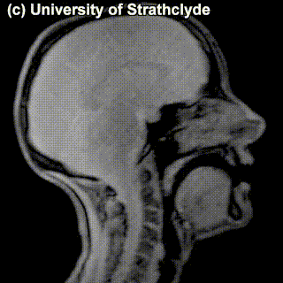  | 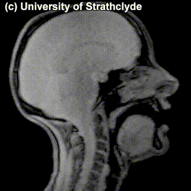  |
| **/t/**    |  **/s/**   |

Sounds like /t/ are called **stops** (also, **plosives**), sounds like /s/ are called **fricatives**. **Affricates** are a combination of these two: they are stops immediately followed by fricatives: for instance,  t&#643; as in _**c**hair_ and d&#658; as in _**g**eneral_. If we add the 'manner of articulation' dimension to our table above, we will get our consonants more organized:

|         |   bilabial   |  labiodental    |   alveolar    |   palatal    |   velar / uvular   |   glottal    |
| :-:  | :-: | :-: | :-: | :-: | :-: | :-: |
| stop | p, b |    | t, d |   | k, (g) | &#660; |
| fricative |     | f, v   | s, z | &#643;, &#658; | x, &#611; |  |
| affricate |     |   | | t&#643;, d&#658; |  |  |
| nasal | m   |     | n | | &#331; | |
| other stuff |  |   | l, r | j | | |

Some sounds ended up in the same cell anyway -- and the difference between those is not really seen on scans of the pronunciation process -- try to see if there's different that catches your eye in the MRIs for /s/ and /z/:

|      |       | 
| :-: | :-: | 
|   | 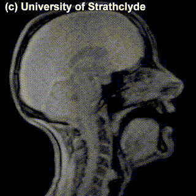  |
| **/s/**    |  **/z/**   |

You probably didn't see anything -- and that's because there's no difference in the place of articulation or in the level of the restriction in airflow. The difference between these sounds is the use of voice vs. no use of voice in producing the sound: /z/ is voiced and /s/ is voiceless; the vocal cords vibrate while producing the former but not the latter. One can't really see this at the MRIs of this level of detail. If we factor the voiced vs. voiceless distinction into the organization of the consonants we've been looking at, we have a system that uniquely characterizes practically any consonant so far (we've sort of ignored the slightly more complicated ones labelled as 'other stuff') just by specifying its properties: place of articulation, manner of articulation and whether it's voiced. 

|          |   bilabial   |  labiodental    |   alveolar    |   palatal    |   velar / uvular   |   glottal    |
| :- | :-: | :-: | :-: | :-: | :-: | :-: |
| **stop**  <br>  &nbsp;&nbsp;&nbsp;&nbsp;&nbsp; voiced <br>  &nbsp;&nbsp;&nbsp;&nbsp;&nbsp; voiceless  | <br> b <br>  p |    | <br>  d  <br>  t |   | <br> (g) <br> k | <br> <br> &#660; |
| **fricative** <br>  &nbsp;&nbsp;&nbsp;&nbsp;&nbsp; voiced <br>  &nbsp;&nbsp;&nbsp;&nbsp;&nbsp; voiceless   |     | <br> v <br> f   | <br> z <br> s | <br> &#658; <br> &#643;  | <br> &#611; <br> x  |  |
| **affricate**   <br>  &nbsp;&nbsp;&nbsp;&nbsp;&nbsp; voiced <br>  &nbsp;&nbsp;&nbsp;&nbsp;&nbsp; voiceless  |     |   | | <br> d&#658; <br> t&#643; |  |  |
|  **nasal** | m   |     | n | | &#331; | |
|  **other stuff** |  |   | l, r | j | | |


This is, of course, just a pretty small subset of consonants that are used in languages around the world. What are other potential consonants? First of all, there are some gaps in the table above, and some of these empty cells are not universally empty. For instance, **palatal stops** exist in Hungarian, Icelandic and Irish. 

`````{admonition} A tiny question along the way
:class: attention 
Can you pronounce a voiceless palatal stop? What about a voiced palatal affricate?
`````

Aside from that, this table isn't complete in a sense that it does not represent **all** possible contrasts between consonants that languages make use of. In Russian, for example, a lot of consonants have **palatalized** correlates -- there is /m/ and there is /m<sup>j</sup>/, where the tongue is located somewhat closer to the center of the palate; this contrasts cross-cuts the whole system of consonants.

Moreover, all of the consonants we have discussed so far are **pulmonic** -- produced by the pressure of air flowing from the lungs through the mouth and/or nose. But in many languages, there are also **non-pulmonic** consonants: for example, **ejectives**. To pronounce an ejective, you start with a glottal stop, and raise the glottis to produce air pressure. The glottis must be fully closed, so there are no voiced ejectives. Here's a super-helpful instruction that is attributed to the phonetician Peter Ladefoged:

```{margin} 
Check out the [MRI of this sound](https://www.seeingspeech.ac.uk/ipa-charts/?chart=2#location=107700)! 
```

> In order to practice making an ejective sound, start by holding your breath. Now, while you're still holding your breath, try to make a /k/ sound; make the sound as loudly as you can, so that somebody sitting next to you can hear it. Now relax and breathe again. Congratulations! You've just made an ejective /k'/.

Ejective consonants are famously a part of consonant system in Geogrian, so instead of the familiar **voiced vs. voiceless** contrast, for many consonants Georgian has a 3-way contrast **voiced vs. voiceless vs. ejective** (there is  debate about voiceless being actually something a bit different, aspirated, but that's beyond the point now).

Other non-pulmonic consonants are **clicks** and **implosives**, feel free to read more on them and explore their pronunciation. I think the above is enough for a general idea how the space of sounds is organized both for consonants and for vowels when it comes to their articulation. 

### Acoustic and auditory phonetics

We talked about how speakers produce sound, but this sound signal then has to reach the addressee and be heard and interpreted. The discipline that studies physical properties of sound signals is **acoustic phonetics**. It's somewhere between linguistics and physics, part of a more general area of physical acoustics -- study of the creation and propagation of sound waves. 

There is a causal connection between articulation and the resulting sound -- the movement of speech organs affects the sound. It's kind of obvious, but the exact shape of these dependencies is pretty complex. We won't have a lot of time to devote to acoustic phonetics, but I wanted to say a couple of basic things. 

When we speak, we produce **sound waves**. Sound waves can be **periodic** and **aperiodic**. In periodic waves, some portion is repeated over and over again -- in terms of articulation, periodic sound waves are caused by vibration of vocal cords when a vowel or a voiced consonant is pronounced. Aperiodic waves have no repeated component and correspond to the noise produced by fricative consonants or after the stop is released in stops and affricates. 

We can see this when we look at visual representations of the sound waves. One popular representation is **waveforms** (a.k.a. oscillograms), where the horizontal axis is time, and the vertical axis is the amplitude (sound pressure). There's quite a lot you can see in a waveform. For instance, look at the waveform for a phrase _on our website_:

```{margin} 
[Source](https://swphonetics.com/praat/tutorials/understanding-waveforms/speech-waveforms/)
```
```{image} ./images/speechaonourwebsite.png
:alt: Waveform
:class: bg-primary mb-1
:width: 500px
:align: center
```

The periodic vs. aperiodic segments are very visible here and provide clues for identifying different sounds in the sequence (vowels and voiced consonants vs., for instance, unvoiced fricatives; the pauses are parts of stops). Here's another waveform, of a sequence _publish_, annotated with segments and their parts:

```{margin} 
[Same source](https://swphonetics.com/praat/tutorials/understanding-waveforms/speech-waveforms/)
```
```{image} ./images/speechhpublish.png
:alt: Waveform
:class: bg-primary mb-1
:width: 300px
:align: center
```

Some observations:
- The voiceless occlusion of /p/ is clearly defined (1). 
- This is followed by aspiration (2) and the vowel /a/.
- Voicing during the occlusion of /b/ (3) is followed by the burst (4).
- There is aperiodic hissing (5) for the final fricative /&#643;/.

Waveforms don't provide a detailed enough representation when you're interested in the frequences of the sound. For a more detailed analysis, a different type of representation is used -- a **spectrogram**. Spectrograms encode information along three dimensions: time, frequency and amplitude. Here's how these three dimensions are squeezed into a 2-dimensional graph: the horizontal axis encodes time, the vertical axis encodes sound frequency (from low to high), and the third dimension corresponding to the amplitude of a particular frequency is encoded either by shades of grey (the darker the higher) or by color. The frequency distribution for the spectrogram is calculated from the sound wave: the complex wave form is decomposed into a combination of simpler ones, where each of the simpler waves is characterized by its own frequency, amplitude and phase. There are different algorithms for such estimations and the resulting spectrograms are, consequently, also somewhat different. 

Here is a spectrogram of me pronouncing the same word _publish_:

```{margin} 
Generated using an [online spectrogram-generating tool](https://auditoryneuroscience.com/acoustics/spectrogram) that takes input directly from your microphone.
```

```{image} ./images/publish_spectrum.png
:alt: spectrogram
:class: bg-primary mb-1
:width: 600px
:align: center
```

`````{admonition} A tiny question along the way
:class: attention 
Which segments can you identify on this spectrogram?
`````

In this spectrogram, if you focus on the vowels, you can see concentrated frequency regions with high associated amplitude. Those are called **formants**, and these formants uniquely characterize vowels and distinguish them from each other. Let's look at better quality (this time, gray-scale for a change) spectrograms for some basic vowels:

```{margin} 
Image taken from _Kibrik et al. 2019. Introduction to Language Science_. (in Russian).
```
```{image} ./images/vowels_spectrum.png
:alt: spectrogram
:class: bg-primary mb-1
:width: 800px
:align: center
```
You can see the difference between the vowels in where the regions of highest amplitude -- the formants -- are located. Typical values of the first and second formant are summarized in the table below:

|    <br> F1 (Hz)  |   <br> 2000-2500  |  <br> 1600-2000  |  F2 (Hz) <br> 1300-1400   |  <br> 800-900    |   <br> 500-600  |
| :- | :-: | :-: | :-: | :-: | :-: | 
| **300** | <big>i</big> |     |     |      |    <big>u</big> |
| **500** |   |  <big>e</big>  |    |    <big>o</big>    |   |
| **700** |   |      |    <big>a</big>   |     |   |

When organized this way, the relation between formants and articulation is visible: generally, F1 is related to the high/low feature of vowels (the higher F1, the lower the vowel) and F2 is related to the front/back feature (the higher F2, the more front the vowel). The property rounded / unrounded simply lowers all formants, for the rounded vowels.

Unfortunately, we will need to leave acoustic phonetics at that, even though we barely scratched its surface. I will just list some resources you can play with further if you feel like it.


`````{admonition} Resources for self-study: Acoustic phonetics
:class: tip
- A [spectrogram-generating tool](https://auditoryneuroscience.com/acoustics/spectrogram) I used to generate one of the spectrograms above. It works from your browser and doesn't require installing anything on your computer. You can just pronounce different things and see how altering your articulations changes the spectral properties of the resulting sound. [Another similar tool](https://www.speechandhearing.net/laboratory/wasp/) that produces both a waveform and a spectrogram. This tool can also find and annotate major formants.
- An [interactive vocal tract](https://imaginary.github.io/pink-trombone/index.html?lang=en): you can move articulatory organs into different positions and see how this affects the sound.
- [Waveform + spectogram Wordle](https://nascl.rc.nau.edu/gramle/)!
`````

When it comes to the whole cycle of speech-based communication, it's not enough to look at articulation and the actual physical properties of the resulting sound. This sound needs to be perceived and analysed by the hearer -- and this last part is studied by **auditory phonetics**. It's concerned with both how the sound travels to the human ear and how the signal gets picked up by the corresponding brain regions to be analyzed linguistically. This process is complex and involves synthesising purely acoustic information and a bunch of other types of information. Just one illustration is the McGurk effect, shown in this video below. First, listen to it without actually looking at the video, remember what you hear; then play the video again, now looking at the screen. What do you hear now?


<div align="center">
<iframe width="400" height="300" src="https://www.youtube.com/embed/aFPtc8BVdJk?si=STkQnPQcaXBF4m5t" title="The McGurk effect" frameborder="0" allow="accelerometer; autoplay; clipboard-write; encrypted-media; gyroscope; picture-in-picture; web-share" allowfullscreen></iframe>
</div>

In principle, just listening to the sound would give you the _bababa_ kind of sound; when the video is added, you probably hear something like _dadada_ -- same sound, but your brain is re-analysing the perceived sound in light of visual clues about the articulation. I'll just leave it at that! 

### Above the level of individual sounds

We discussed individual speech sounds a lot, but a speech sound rarely -- if ever -- occurs in isolation. They come in sequences, as parts of words or phrases that we utter or hear. In fact, if you look again at the MRIs, waveforms and spectrograms of words and phrases above, it's more often than not impossible to find a precise border between different sounds, the sounds are sort of jammed together and overflow into each other, together forming one unit of articulation and sound. It's our knowledge of the language that imposes a discrete structure on this continuous sequence, but both the physical and the linguistic reality is that sounds in a sequence interact to each other. There is a system in how the sounds can or cannot be grouped together, and there are properties and processes that apply to speech sounds only as a group, not individually. Let's talk about some of them.

#### Syllables

The smallest linguistically relevant group of sounds is a **syllable**. 'Linguistically relevant' here means that there are linguistic rules that are best formulated in terms of syllables; you'll have to trust me on that. Also, apparently, syllables have some psychological reality for the speakers, as evidenced by how widespread the syllable-based writing systems are, among other things. Let's take a quick look at the syllable structure and how it is typically realized in different languages. 

Here's the general structure of a syllable, with its hierarchy of elements: the **nucleus** -- the core of the syllable -- is usually a vowel (very rarely a consonant); together with the **coda** (a consonant or a sequence of consonants) it forms the **rime**, or **rhyme**, of the syllable; a consonant or sequence of consonants before the nucleus is the **onset**. Here is the structure of a monosyllabic Dutch word _niks_:

```{image} ./images/syllable.png
:alt: syllable structure
:class: bg-primary mb-1
:width: 220px
:align: center
```

What are possible ways to fill in these different positions in a syllable? Let's start with some writing conventions: we will write 'C' for 'consonant' and 'V' for 'vowel'. There is not much variation happening in the nucleus -- it's practically always just V (we ignore some edge cases). As for the rest of the structure -- there is quite some options with respect to what can happen here. 

One type of syllable that seems to be universal -- as in, every language we know has syllables with this structure -- is CV: onset with one consonant and empty coda. For most languages though, this is not the only type of syllable that it has. If we classify languages according to the most complex syllable structure they allow, here is how languages of the world will be distributed against the resulting types:

```{margin} 
Data from [Feature 12A: Syllable Structure](https://wals.info/feature/12A#2/19.3/152.9), The World Atlas of Language Structures. 
```
```{image} ./images/syllable_structure_types.png
:alt: syllable structure
:class: bg-primary mb-1
:width: 600px
:align: center
```

The 'simple syllable structure' here corresponds to (C)V syllables (that is, either CV or just V). Examples of moderately complex syllable structure would be syllables like CVC or CCV (but with severe constraints on the 2nd consonant in the onset). Everything more complex than that falls under 'complex syllable structure'. An example of a language with complex syllable structure is English, where the pattern for possible syllables can be written as (C)(C)(C)V(C)(C)(C)(C) (fully spelled out in, for instance, _strengths_). Dutch syllable structure is usually analyzed in the same way as in English, but it's harder to find the fully pronounced potential structure. 

`````{admonition} A tiny question along the way
:class: attention 
Can you come up with a word with a syllable that has 4 consonants in a coda? 
`````

#### Stress 

```{margin} 
Some languages have been argued not to have word stress at all! One example is French. 
```
Syllables organize into bigger objects -- words. There are sound-related phenomena that operate at the level of words rather than lower levels, syllables and segments. In many languages, for instance, a word is characterized by **word stress**. When a syllable in a word carries word stress, usually this means that this syllable is made prominent in some way. Often, the stressed syllable is louder, has different pitch; often, it's also longer and/or has less central articulation than other syllables. 

Choice of the syllable for word stress is guided by different principles in different languages. A bit more than half of the world's languages have word stress in the fixed position within a word -- most often, on the penultimate (Breton, Polish), first (Czech, Estonian) or last (Hebrew, Persian) syllable of the word.

```{margin} 
Data from [Feature 14A: Fixed Stress Locations](https://wals.info/feature/14A#2/21.6/149.1), The World Atlas of Language Structures. 
```
```{image} ./images/stress_types.png
:alt: stress
:class: bg-primary mb-1
:width: 600px
:align: center
```

Almost half of the languages don't have fixed stress though. These languages fall into two groups: 

- languages with more complex stress placement rules;  
- languages with 'phonemic' word stress.

```{margin} 
A linguistic puzzle that you will face in the seminar this week will allow you to practice inferring a stress placement rule given limited linguistic data. Stay tuned!
```

In the first case, you can still predict lexical stress if you know the rule; in the second case, there is no way to predict the stress unless you know the stress profile of the word you are looking at -- so, basically, stress has to be memorized on a word-by-word basis. Sometimes you can tell the first type of language from the second type of language easily: if a language has pairs of words that are distinguished in pronunciation by stress placement only, we are dealing with phonemic word stress. An example is English, with pairs like _insight_ /'&#618;nsa&#618;t/ vs. _incite_ /&#618;n'sa&#618;t/; or Dutch with _v&#243;&#243;rkomen_ vs _voork&#243;men_.

There are other phonetic and phonological phenomena above the level of segments (= supersegmental phenomena) that we, unfortunately, have to completely ignore in this course. But I hope that the above will give you a good enough start, and if you ever work on speech-related applications, this will the starting point of your journey!


 `````{admonition} External content
:class: danger
What's the limit of sounds that can still function as speech sounds? A sort of a corner case here are whistled languages, along with other 'secondary languages' such as drum languages. A student presentation will introduce whistled languages.
`````


### Sign languages

 `````{admonition} External content
:class: danger
The topic of sign languages -- and how they are fundamentally different from 'secondary languages' mentioned above -- will be covered by a student presentation based on the paper _Jeremy Kuhn. 2023. Sign languages: in France and across the world._
`````

`````{admonition} Homework 2
:class: note

**Task 1**

Read the '[Phonetics](https://web.stanford.edu/~jurafsky/slp3/28.pdf)' chapter from _Speech and Language Processing. Daniel Jurafsky \& James H. Martin. Draft of January 7, 2023_. Submit a list of **3 things** that this chapter discusses that are either absent in my course notes and the lecture, or are different from what I said.

**Task 2**

Here are the names of 10 municipalities in the Netherlands. You will need them for two puzzles below.

1. Laren
2. Garyp
3. Almen
4. Dalen
5. Sumar
6. Ulrum
7. Asten
8. Bedum
9. Lopik
10. Delft

_Puzzle 1_

Look at the MRI images of five sounds below. Each of the images encodes a sound (taken in isolation or in a neutral context). Together, they form a sequence -- a name of a municipality in the Netherlands from the list above. Guess which one! Try to look at places of articulation and think what class this sound belongs to (vowel? consonant? front? alveolar? labial?). Say something about how you came up with your answer.

|              |              |               |               |               |               | 
|   :----:    |    :----:    |    :----:    |     :----:   |     :----:   |     :----:   |
| 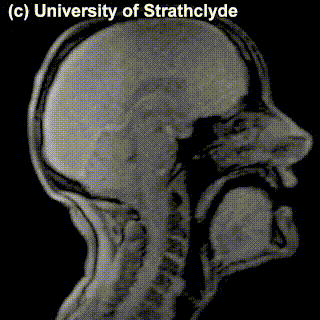  | 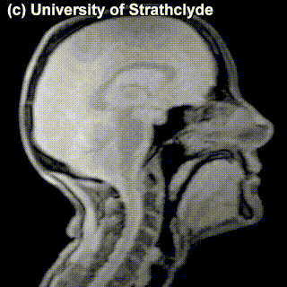   | 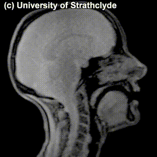    | 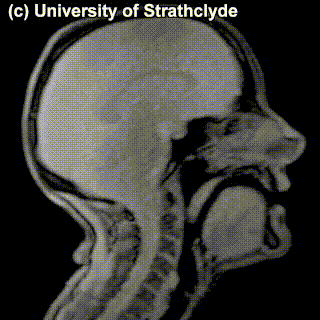  |    |               |

_Puzzle 2_

Identify the municipality given just the information below

|       1       |      2        |         3      |       4        |        5       | 
|   :----:    |    :----:    |    :----:    |     :----:   |     :----:   |  
|    stop     |          |         |   rounded      |          |


**Task 3**

[The first linguistic puzzle](https://bylinina.github.io/ling_course/ling_puzzles.html) -- to be solved in groups during the seminar!

`````

## PART II: Writing

`````{admonition} TL;DR [[slides](https://docs.google.com/presentation/d/1oKhOVWXx4vM9b1eZ5FknvApuuIfA1rZf-zo1xOsRqVU/edit?usp=sharing)]
:class: note
The section covers:
- **Writing** and its basic principles 
- Relation between writing and speech -- writing as an instrument for capturing utterances
- Types of writing systems 
`````

We discussed spoken (and signed!) language, now let's move to another mode of existence of language -- language can also be **written**.  Writing is a relatively recent invention, when judged against the time scale of the existence of human species and human language, it has been around for several thousand years. We will reflect a bit on what writing is and isn't and on existing types of writing systems, and then move on to the relevance of the speech vs. writing distinction for language technology. Let's start with a definition of writing.

`````{admonition} Important notion
:class: warning
**Writing** is a system of recording language by means of visible or tactile marks. 
`````

Like any decent definition, this one **excludes** some things from the defined notion. For instance, a painting or a photograph usually cannot be described as 'writing' (it conveys something but this 'something' is not a sentence or a word, even though it might be describable by a sentence or a word); a voice message on WhatsApp is not writing even though it records language, etc.

Let's define some useful terminology.

- '**Writing system**' has two meanings: 1) the writing system of an individual language; 2) an abstract type of writing system. In the first sense, there are as many writing systems as there are written languages, but in the second sense the number is limited to a few types, such as logographic or word writing systems, syllabic writing systems, phonetic writing systems, or variant forms thereof. 
- **Script**: the graphic form of the units of a writing system (as in, 'The Croatian and Serbian writing systems are very similar, but they employ different scripts, Roman and Cyrillic, respectively.')
- **Orthography** (=**spelling**): the standardized variety of a given, language-specific writing system (as in, 'American and British orthography or spelling conventions differ in some details.')
- '**Alphabet**' is used to refer to either 1) the inventory of basic signs of a phonological writing system; or 2) of any writing system in general (as in, 'The Tibetan alphabet consists of 30 letters'.)

The starting point of talking about the relation between speech and writing are the following three important facts:
1. A lot of languages (in fact, probably the majority of languages of the world) are not written, that is, do not have a canonic way of writing them down. 
2. That there are no languages that have written form but no spoken (or signed) form. 
3. The writing system of a language can change without affecting the language much. [Azerbaijani](https://en.wikipedia.org/wiki/Azerbaijani_language) is an example of a language that underwent three changes of writing systems within the course of one century (Arabic script → Latin → Cyrillic → Latin). This didn't have any dramatic effect on the language itself. 

What these three facts in combination mean is that written language is secondary to spoken -- actually, a type of language technology, an extra advancement on top of natural language to help with its transmission and storing. So, when we say that speech and writing are two different 'modalities' of language, we don't mean that they have equal status. They don't!

Let's look at differences between speech and writing that are listed in one popular book on writing systems and think about them together:

```{margin} 
Coulmas, F. 2003. _Writing systems: An introduction to their linguistic analysis_. Cambridge University Press.
```
|          speech         |      writing     |
|:-----------------------:|:----------------:|
| continuous              | discrete         |
| bound to utterance time | timeless         |
| contextual              | autonomous       |
| short-lived             | permanent        |
| audible                 | visible          |
| produced by voice       | produced by hand |


`````{admonition} Discussion point
:class: tip
Do all of these differences make sense? Do you agree with these distinctions? What consequences do they have?
`````

Some of these differences do not really stand the test of time: for instance, the short-lived vs. permanent distinction seems less relevant now with all the voice messages and other ways to store speech signal. Some of these differences are fundamental and definitive -- for instance, the continuous vs. discrete divide will become relevant when we talk about modalities of language technology.

Writing is a tool to record and transmit utterances. If we think of an utterance as this dual object that's a combination of meaning and sound that expresses this meaning, what are possible strategies for writing it down? Should we focus on the **meaning** and try to transmit the meaning directly; or should we focus on the **sound** and look for a way to write down the sound? The second answer might seem most natural to us, but that might be due to the fact that we are used to the writing system designed this way. But it's not the only possible way. For instance, you might have heard about **ideographic** writing systems -- the name suggests writing down ideas or thoughts directly. But can you actually have a system that directly writes down sounds or thoughts? 

Let's start with **sound**, since this is something we discussed a lot recently. A perfect, objective encoding of sound by means of writing is hardly possible or convenient. We saw that sound is very variable, fluid, with individual sounds intertwined with each other during speech. The same word or phrase pronounced by a child vs. a grown-up, a person who's sad vs. who's happy and so on would be physically different in terms of the sound. Moreover, it's impossible even for one and the same person to pronounce something exactly the same way twice. A true sound-oriented writing system would record all this, but it makes no sense -- because actually a lot of the aspects of sound don't matter for encoding a message. Maybe a sound-oriented writing system should just encode as many properties of the sound as possible? A writing system like that would basically be **transcription**, like IPA discussed before. Still, transcription is not particularly convenient for everyday use of the speakers: IPA, for instance, has quite a lot of symbols, and encodes contrasts that, for a particular language, again, don't necessarily matter. Why would speakers of a language learn all the distinctions between different types of vowels and consonants that their language's sound system does not care about? Their writing system should not encode such distinctions. In short, transcription is typically meant to be language-independent and writing systems -- even those focussing on individual sounds -- encode 'sound' in a language-specific way. It does not provide a true and accurate recording of sound. And it shouldn't!

What about writing down **ideas** (or **thoughts**?) rather than sounds? There is an obvious obstacle to that: what are ideas actually? How many are there? There's probably an infinite number of thoughts out there, so we can't really have a writing system with a symbol for each one. We'd need to break ideas down in some way so that we can then write down ideas as a combination of their components. What parts do ideas have though? I have no clue. But **utterances** expressing ideas certainly have parts -- for instance, words! We can design a symbol for each word and then combine them together as needed. But that won't be exactly encoding ideas in writing -- that would be encoding **a sequence of words that together express an idea**.  A more accurate term is **logographic** writing systems (= writing down words) rather than ideographic. For instance, Chinese writing is -- to a large extent -- logographic, as were ancient Egyptian hieroglyphs. How does one make a logographic writing system? Assign each word a symbol, and that's it!

```{margin} 
Images by Freepik.
```
|          word         |      symbol     |
|:-----------------------:|:----------------:|
| <br>bee              |          |
| <br>leaf  |          |
| ... | ...         |

The above follows the same principle as Chinese characters **&#23665;** for 'mountain' and **&#26408;** for 'tree'.

`````{admonition} A tiny question along the way
:class: attention 
Texts written in English (or in Dutch, or in any other European language, for that matter), contain quite some logograms -- or maybe actually ideograms! Can you figure out what they are?
`````

In practice, a pure logographic system is hardly possible. A language has -- very approximately -- around 400k words. It's unrealistic to have a separate symbol for each of them, and writing systems actually never do. At some stage of development logographic writing systems inevitably extend the use of existing symbols based on the sounds of the words they encode. This gives rise to the **rebus principle** that the writing system starts to support. Let's say I needed to write down the word _belief_ but didn't have a symbol for it at my disposal -- I might then use the symbol for _bee_ for its sound regardless of the meaning; and I might do the same for the symbol for _leaf_:

|          word         |      symbol     |
|:-----------------------:|:----------------:|
| <br>belief              |          |

This trick -- or some variation of it -- is used in many logographic systems we know. In the Chinese writing system, when a character can be used to encode more than one word that sound the same, often an element has to be added to the character that disambiguates the use. For example, the word _m&#249;_ can mean 'tree' or 'to wash oneself'. As we saw above, the character for tree is **&#26408;**; the character for 'to wash oneself' is **&#27792;**, which has the same main element as 'tree', but also contains the element **&#27701;** 'water', that indicates that this particular _m&#249;_ has to do with water. A pretty complicated system!

Writing systems that encode the smallest segments possible -- individual sounds --  as opposed to systems encoding words (modulo complications discussed above) are often called **phonetic** or **phonological** writing systems. They are familiar to us, since this is the one we are using now! Roman (a.k.a. Latin) script that is used in English -- and in Dutch -- has Egyptian hieroglyphs as a far ancestor, but has evolved to encode abstract speech sounds. A lot of alphabets used today have a noticeable overlap in symbols, due to their common origin (but some alphabets are quite different, see, for instance, Georgian and Armenian):


```{margin} 
A Venn diagram showing the Greek (left), Cyrillic (bottom) and Latin (right) alphabets, which share many of the same letters ([source](https://en.wikipedia.org/wiki/Alphabet)) 
```
```{image} ./images/alphabet_diagram.jpg
:alt: alphabet
:class: bg-primary mb-1
:width: 300px
:align: center
```

If you remember the discussion early on in last week's lecture about how untrustworthy writing can be when it comes to sound-writing correspondences (the **ghoti** example!), you might be confused now. Well, you have the right to be confused: sound-based writing systems usually have a lot of non-phonetic stuff going on that complicates the mapping, mostly for historic reasons. It is what it is!

The phonetic and logographic systems don't exhaust all the options: between the level of individual sounds and the level of words, there is another level of sound units -- **syllables**. A lot of writing systems build on this unit. Such systems are called **syllabaries**. Japanese, for instance, in addition to Chinese characters, has two syllabaries: Hiragana (for native Japanese words) and Katakana (for loanwords).

```{margin} 
Left: Hiragana ([source](https://en.wikipedia.org/wiki/Hiragana))

Below: Katakana ([source](https://en.wikipedia.org/wiki/Katakana))
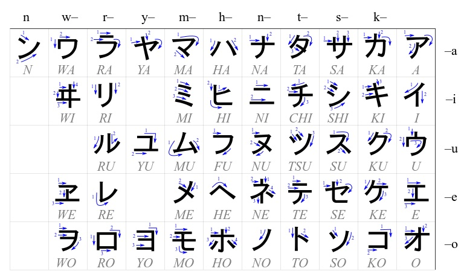
```
```{image} ./images/hiragana.jpg
:alt: hiragana
:class: bg-primary mb-1
:width: 600px
:align: center
```
One famous writing system that is somehow between an alphabet and a syllabary is Hangul, a Korean writing system developed in the 15th century. It is remarkably transparent, as the symbols for syllables are put together from individual components corresponding to consonants and vowels in a small number of predictable ways. 


```{margin} 
Hangul structure ([source](http://easykorean.edsoftapps.com/learn-structure-of-hangul/))
```
```{image} ./images/hangul.jpg
:alt: hangul
:class: bg-primary mb-1
:width: 450px
:align: center
```
Another notable writing system is **abjad** -- a system where only consonants are represented. This system is used in Arabic and Hebrew, for the reasons that we will discuss in the morphology lecture! It wouldn't be as convenient for English, but to some extent it would've work (let's say, to the extent you can read and understand the phrase _th qck brwn fx jmps vr th lz dg_).

The last system I want to mention is somewhat similar to abjad and is called **abugida**. In this system, basic characters denote consonants followed by a particular vowel, and additional signs can denote other vowels. An example is Tibetan.


```{margin} 
Universal Declaration of Human Rights, article 1, written in Arabic (abjad), Hebrew (abjad) and Tibetan (abugida). <br> Coulmas, F. 2003. _Writing systems: An introduction to their linguistic analysis_. Cambridge University Press.
```
Arabic (abjad):
```{image} ./images/arabic.png
:alt: scripts
:class: bg-primary mb-1
:width: 500px
:align: center
```
Hebrew (abjad):
```{image} ./images/hebrew.png
:alt: scripts
:class: bg-primary mb-1
:width: 700px
:align: center
```
Tibetan (abugida):
```{image} ./images/tibetan.png
:alt: scripts
:class: bg-primary mb-1
:width: 600px
:align: center
```

There is much more to writing systems than what I was able to tell you, but before we leave this chapter, I wanted to show you this super-helpful chart that comes from [Neography](https://neography.info/writing-systems/), a project which focusses on creation of writing systems. You can find more examples and discussions there! 
```{margin} 
[Source](https://neography.info/writing-systems/)

Consonants:
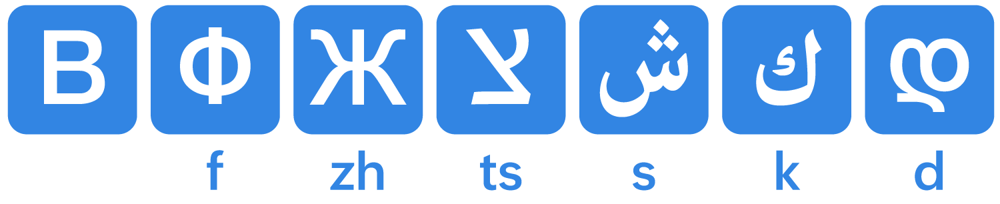
Vowels:
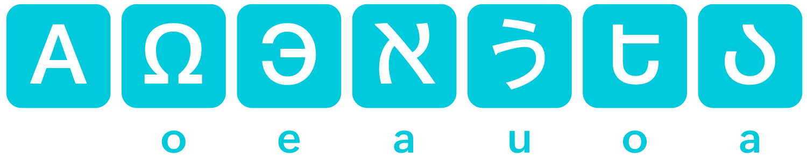
Syllabograms:

Logograms:
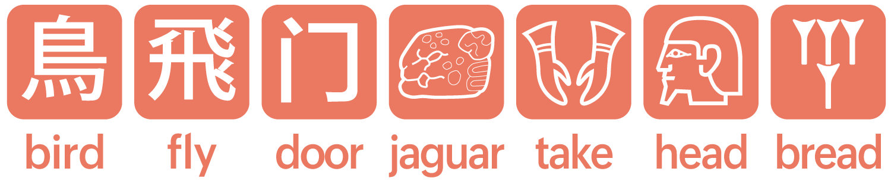
```
```{image} ./images/types_of_scripts.png
:alt: scripts
:class: bg-primary mb-1
:width: 700px
:align: center
```

Finally, a parameter that is orthogonal to the size of the unit that that writing system is based on (word, syllable, individual sound) is the **direction** of writing. Most European languages write from left to right and top-to-bottom. But this is not the only option, and this is good to keep in mind!

```{margin} 
[Source](https://vividmaps.com/writing-directions-of-the-world/)
```
```{image} ./images/writing_directions.jpg
:alt: scripts
:class: bg-primary mb-1
:width: 700px
:align: center
```

Here is the main take-away from this section: In practice, all writing systems that are meant to convey the whole variety of possible messages in a language rely on sound in some way. But still the main working units of different writing systems are different:

- **Logographic** writing systems focus on words as their unit (Chinese, Japanese)
- **Syllabaries** encode syllables (Japanese, Korean..)
- **Alphabets** encode individual sounds (English, Dutch, Georgian, Armenian..)
- There are systems that are somewhere in between! 

This should be enough to keep you aware of what you are dealing with if you need to use or design a text-based system dealing with various languages. If you want to learn more about writing, its variants and history, you might find some the resources below useful.

`````{admonition} Resources on writing systems
:class: tip
- [The World's Writing Systems](https://www.worldswritingsystems.org/) -- a project organizing old and existing writing systems along different parameters; a good FAQ!
- [Omniglot](https://www.omniglot.com/) -- a comprehensive online encyclopedia of writing systems and languages
- [Neography](https://neography.info/writing-systems/) -- a very nice project on creating new writing systems, which also summarizes existing ones well!
`````

This is all I plan to communicate to you about the ways of transmitting and capturing language (a.k.a. language modalities). During the last two weeks, we talked about speech sounds and signs; and we talked about writing and how it relates to sound and meaning. We now move on to the relation between the things we discussed so far -- and language technology.


## PART III: Speech, text and language technology

`````{admonition} TL;DR 
:class: note
- Speech and text-based systems have their own typical associated tasks
- The field of language technology is text-dominated
- But it doesn't have to be! And maybe shouldn't be
- There is a tendency to formulate deeper tasks in terms of sound directly
`````

Systems that linguistically interact with users differ in the type of input that they take (and the output they give). The main two types of systems are: 

- the ones that analyse and/or output **speech**; 
- the ones that deal with **text**.

Natural language processing and computational linguistics are to a large extent text-dominated fields. If we look at the proportion of speech- and sound-related papers in the [ACL Anthology](https://aclanthology.org/) (a comprehensive database of NLP papers covering all the main conferences, journals and workshops), we will see that it never goes above 20%, and apart from the spike in 1989 (inclusion of the Speech and Natural Language Workshop in the Anthology), stays mostly below 10%:

```{margin} 
Graph from [Grzegorz Chrupała. 2023. Putting Natural in Natural Language Processing](https://arxiv.org/pdf/2305.04572.pdf).
```
```{image} ./images/acl.png
:alt: acl
:class: bg-primary mb-1
:width: 500px
:align: center
```

```{margin} 
[Huggingface.co](https://huggingface.co/) is a platform where one can find -- and upload their own! -- models, datasets, spaces for different tasks having to do with natural language processing, computer vision etc. If you haven't seen it before (there were a couple of references to it during Week 1!), you should familiarize yourself with it and things you can find there!
```
Classic tasks for speech technology are **Automatic Speech Recognition** (ASR) -- given the sound input, the model outputs its written form -- and **Text-to-Speech** (TTS) that maps written text to sound. You can try some of these models on Huggingface: see models under [ASR](https://huggingface.co/models?pipeline_tag=automatic-speech-recognition&sort=trending) and [TTS](https://huggingface.co/models?pipeline_tag=automatic-speech-recognition&sort=trending) tasks. Recent ASR models, for instance, are very impressive! Whisper from OpenAI is a recent model that is doing a pretty amazing job mapping speech to text for 75 languages -- you can try it yourself on [its Huggingface page](https://huggingface.co/openai/whisper-large-v2) or [a Huggingface space that uses this model](https://huggingface.co/spaces/sanchit-gandhi/whisper-large-v2).

As for **text-based** models and systems, we've seen some of them before, in the introduction lecture. The range of tasks that are typically defined and implemented over text is  broad:
- text summarization, 
- question answering, 
- machine translation 
- and many many others. 

In principle, there is nothing specifically **textual** about these tasks -- they could as well be defined over speech: you may want to summarize a spoken interaction or monologue, answer a spoken question about such interactions/monologues etc. In practice, a lot of systems with speech input and/or output targeting complex tasks like these are in fact multi-component pipelines: first, an ASR system maps spoken input to its written form, then a text-based model is called (a.k.a. cascaded systems); similarly for systems with speech output -- often, it's actually text output with a layer of TTS. This is, for example, the way virtual assistants such as Siri and Alexa work -- at least, for now.

```{margin} 
A cascaded system with speech input / output. (Yep, I drew it on my iPad, why not)
```
```{image} ./images/cascade.jpg
:alt: cascaded
:class: bg-primary mb-1
:width: 550px
:align: center
```

There are upsides and downsides to this approach. One benefit is clear: given that NLP has for decades been a predominantly text-oriented field, and all this time text-based tasks have been the focus of a large research community, now it just works pretty well! So it's a natural solution to reduce spoken tasks to text-based tasks by sticking ASR/TTS modules on either side of the system. 

But **why** has written text been the primary language modality for NLP? 
- **One reason** is large quantities of available text data: Wikipedia, social networks and all interactions there, digitized books and so on. More data means better systems trained on these data. 
- **Another reason** might be cultural: we are used to seeing written texts as more valuable, more important and more worthy of analysis. 
- **Finally**, written language is simply easier for computational modelling. As we discussed earlier, spoken language is messy, intrinsically non-segmented and variable. Even if you try very hard, there is no way you can pronounce one and the same word in exactly the same way twice. The pronunciation and the resulting sound varies even more when a word or a phrase is pronounced by speakers of different ages or dialects; depending on its position in the message and so on and so forth. We as listeners factor out a lot of this variation without any problem; and all the various pronunciations of the same linguistic elements  correspond in writing to one and the same, discrete sequence of letters. This sequence is easier to deal with, since a lot of complexity of spoken language does not show up in this representation. 

There are also **problems** with treating written text as the default input/output of language technology. The main issue is actually the same as the last point we discussed above! In writing, a lot of information is lost: the intonation, the general tone of voice, a lot of things about speaker identity (age, gender etc.) that can contribute to the message that the utterance conveys. This loss of information can be a good thing -- in a sense that it makes the analysis of written language a comparatively simpler task -- but it at the same time makes the task harder when it comes to certain other phenomena that rely on the aspects of the spoken utterance that are typically not written down. Think about sarcasm, for instance. It's often marked in speech by a complex combination of intonation, sound duration and more. When our interlocutor is angry or sad, often it's not the words themselves that indicate that, but we can still pick it up from how the person sounds. For many tasks in natural language processing, it's important to identify these aspects of the interaction, but the written form does not convey them directly, making the task hard.

`````{admonition} A tiny question along the way
:class: attention 
Think about the properties of the spoken version of the phrase 'Wow, thanks for your help!' that would make it sound sarcastic or sincere.
`````

Here is another thought about the relation between speech and writing in language technology. When we talked about writing, we established that writing is secondary to speech -- historically and acquisitionally. We learn to write and read **after** we learn to speak, and quite a noticeable percentage of people across the world do not learn how to write or read even in languages that have written form. Writing is just a convention to convey the spoken message. A language can have one or more writing systems, can switch from one writing system to another many times in the course of its history without much effect on the actual spoken form. Whenever a message is written, there is always a corresponding spoken message that it represents (you can pronounce it -- for instance, reading out loud). Now think about a text-based NLP system. Text is the **only** thing they know about language. There's never a step to recover a spoken version of what's written -- so, it's kind of the opposite of what people do, I guess! If a language has two written forms, a model exposed to texts in both will have no way to know they actually correspond to the same language. Will the model somehow learn an alignment between two written forms eventually just looking at the data? Who knows! I don't know work asking this research question. It'd be interesting to find out.


`````{admonition} Oversimplification alert!
:class: warning, dropdown
Ok, the statement 'Whenever a message is written, there is always a corresponding spoken message that it represents' is a simplification. Given how much knowledge we acquire from reading rather from conversation these days, there are some things that we learn to recognize as written words but never actually encounter in their spoken form and don't even know how to pronounce. One class of those things are names of fiction characters: if you have read 'War and Peace', I bet you've **read but never knew how to pronounce** the name 'Andrei Nikolayevich Bolkonsky'. There are other words that are often known from text but are much more rarely pronounced (think 'mischievous', 'hyperbole', 'abugida' and such).
`````

The solution is to embrace the goal of analyzing speech for complex tasks directly! Yes, it is potentially more difficult because of all the variability, but the benefits of getting the full picture of what was said -- and how it was said -- are potentially worth it. The field has been turning in this direction: release of newest speech models such as [HuBERT](https://arxiv.org/abs/2106.07447) signals and drives a turn to deep analysis of speech signal. Some of the recent speech models that can be used for ASR and speech translation actually do the latter directly from the speech signal, without the intermediate step of written representation. I mentioned [Whisper](https://huggingface.co/spaces/sanchit-gandhi/whisper-large-v2) above as an ASR model, but it does speech translation as well (to English only), and it does it directly. Another important recent release is [SeamlessM4T](https://ai.meta.com/blog/seamless-m4t/) from Meta. It's a text and speech model that does ASR, TTS and both text and speech translation -- directly (at least on the input side). Speech translation works from 100 to 30 languages! You can try it out either on their [demo page](https://seamless.metademolab.com/demo) or in a [Huggingface space](https://huggingface.co/spaces/facebook/seamless_m4t) that runs the model.

```{margin} 
An end-to-end system with speech input / output.
```
```{image} ./images/e2e.jpg
:alt: end-to-end
:class: bg-primary mb-1
:width: 450px
:align: center
```

So, ASR/TTS is not all there is to speech technology! In addition to sequence-to-sequence tasks I discussed above, I want to mention [audio classificaion](https://huggingface.co/tasks/audio-classification). Some of the popular tasks are language identification, command identification (very useful for virtual assistants), speaker identification and emotion identification. Try out this [emotion recognition model](https://huggingface.co/ehcalabres/wav2vec2-lg-xlsr-en-speech-emotion-recognition)! These tasks have traditionally been audio-centered -- and it's no coincidence that a lot of them focus on properties of speech that do not get reflected in written form.


Finally, a note on diversity in technology when it comes to linguistic modalities. 

- ASR and other speech technology shows bias that disfavours minorities whose dialects show phonetic traits less represented in speech datasets the models are trained on. If your pronunciation is not 'typical' in some sense relevant for speech dataset construction -- you will have a harder time being understood by a computer. Check out, for example, [a recent paper about racial bias in ASR](https://academic.oup.com/applij/article/44/4/613/6901317)
- Text models show a lot of bias as well, some of it complex – but some of it can be seen on the level of symbols used to represent text. This word cloud, for instance, is meant to visualize _hey_ in 52 languages. The tool fails to render many of the languages (including Arabic, Hindi, and Korean) in its default font. 

```{margin} 
[Source](https://blog.yenniejun.com/p/all-languages-are-not-created-tokenized)
```
```{image} ./images/cloud.png
:alt: wordcloud
:class: bg-primary mb-1
:width: 450px
:align: center
```

- Signed languages are severely underrepresented in language technology. Things are getting better in this field, but there's a long road ahead. I recommend [Moryossef & Goldberg (2021) Sign Language Processing](https://research.sign.mt/) as a resource for those who want to know more!


I guess that's all I wanted to say about sounds, signs and writing! Next week, we are moving on to grammatical organization of language.


`````{admonition} Homework 3
:class: note

To be added soon!

`````

